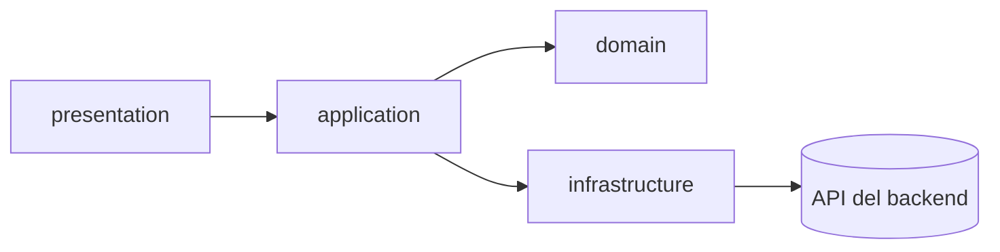

# Frontend

Qué tiene que construir la interfaz web, la pieza más grande que le falta al proyecto para ser un
producto usable.

## Punto de partida

El backend cubre el recorrido completo de un lead: ingesta, viabilidad, puntuación, asignación,
bandeja de revisión y notificaciones. Cada operación de la
[referencia de la API](../desarrollo/api-referencia.md) tiene ya su caso de uso probado. Lo que
falta es la interfaz que lo consuma.

La interfaz actual es una maqueta desconectada de ese backend, no un punto de partida a medias:

- Las capas de dominio e infraestructura del frontend existen y compilan, pero ningún componente
  de presentación las importa. El grafo de dependencias está partido en dos mitades que no se
  tocan.
- Todo el estado vive en el componente raíz con datos escritos a mano; no hay llamada real al
  backend en ningún punto de la navegación.
- La navegación es una variable de estado local, no un enrutador: no hay URLs propias por
  pantalla, ni enlaces directos, ni botón atrás.
- La carga masiva no sube ningún fichero: fabrica un lead de ejemplo y lo añade a la lista en
  memoria.
- No existe manejo de sesión: ni login, ni almacenamiento del token, ni interceptor que lo añada a
  las peticiones, ni noción de rol.
- El cliente HTTP fija `Content-Type: application/json` de forma fija, lo que rompería el login en
  cuanto se conectara: ese endpoint espera `form-urlencoded`.

## Arquitectura a construir

Se conserva la separación en capas ya presente —está bien planteada— pero hay que conectarla de
verdad:

```
src/
├── domain/           modelos y tipos de negocio
├── application/      mappers, servicios y hooks de caso de uso
├── infrastructure/   cliente HTTP, DTOs generados, almacenamiento de sesión
└── presentation/     páginas, componentes, rutas y guards
```

| Elemento | Qué debe resolver |
|---|---|
| Enrutado | Rutas declarativas con URLs propias, enlaces directos y navegación con botón atrás |
| Sesión | Token en memoria con rehidratación al recargar, interceptor que añade la cabecera de autorización, manejo centralizado de sesión expirada y de acceso denegado |
| Datos | Una capa de datos con caché, reintentos y estados de carga y error explícitos, que hoy no existen en ninguna vista |
| Tipos del API | Generados desde el contrato del backend en vez de escritos a mano, para que un cambio de contrato rompa la compilación del frontend en lugar de fallar en producción |
| Guards | Por rol: el gestor accede a la gestión completa, el asesor sólo a su propio panel |
| Estilos | Se mantienen Tailwind y los componentes ya escritos |



## Vistas del panel del gestor

| Vista | Contenido |
|---|---|
| Panel | Indicadores: leads del periodo, distribución por estado, sin asignar, bandeja pendiente, carga por asesor. Los cinco salen de una sola petición, `GET /leads/stats` (ver [referencia](../desarrollo/api-referencia.md) y [ADR-0022](../decisiones/0022-agregados-del-panel.md)) |
| Leads | Tabla con filtros por estado, asesor, grupo, fuente y búsqueda, con columna de asesor asignado. Detalle con desglose de reglas aplicadas, asignación manual y descarte |
| Bandeja de entrada | Registros rechazados con su payload y sus errores. Corregir, reintentar o descartar |
| Alta de lead | Formulario individual |
| Carga masiva | Subida real de fichero con previsualización, mapeo de columnas y resumen de resultado por fila |
| Asesores | Alta, edición, asignación a grupo, activación y desactivación, con la carga actual de cada uno |
| Grupos | CRUD, estrategia por defecto, capacidad, miembros |
| Reglas de puntuación | Constructor de condición, operador y valor, con puntos, activación y un probador contra un lead simulado |
| Reglas de asignación | Constructor por rango de puntuación, grupo o asesores, modo de coincidencia, estrategia y prioridad |
| Notificaciones | Campana con contador y desplegable, con navegación al elemento relacionado |

## Vistas del panel del asesor

| Vista | Contenido |
|---|---|
| Mis leads | Lista de leads asignados, ordenada por fecha de asignación, con búsqueda y filtro |
| Detalle | Ficha completa del lead: datos de contacto, empresa, presupuesto, sector, atributos personalizados, puntuación y desglose |
| Notificaciones | Campana |

## Qué ya existe y se puede aprovechar

Los componentes React ya escritos —cabecera, barra lateral, tabla de panel, formulario de reglas,
cargador de ficheros, ajustes de asesor— están construidos sobre Tailwind y no necesitan
rehacerse. El trabajo es conectarlos a datos reales, no reemplazarlos.

## Correcciones puntuales

Aparte de la arquitectura, hay defectos concretos que arrastrar aunque se reescriban las vistas:

- La lectura de la lista de leads debe interpretar la respuesta paginada del backend
  (`items`, `total`, `limit`, `offset`, `has_more`), no un array suelto.
- El proxy de desarrollo del servidor local debe apuntar al backend; sin él, el modo de desarrollo
  no puede hablar con la API.
