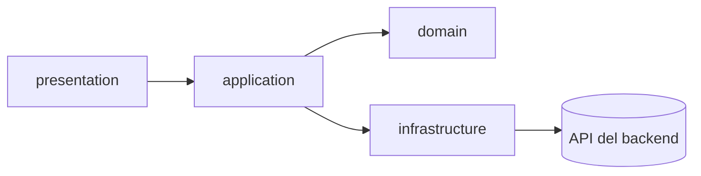
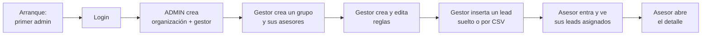

# Frontend

Qué tiene que construir la interfaz web, la pieza más grande que le falta al proyecto para ser un
producto usable.

## Punto de partida

El backend cubre el recorrido completo de un lead: ingesta, viabilidad, puntuación, asignación,
bandeja de revisión y notificaciones. Cada operación de la
[referencia de la API](../desarrollo/api-referencia.md) tiene ya su caso de uso probado. Lo que
falta es la interfaz que lo consuma.

La interfaz actual es una maqueta desconectada de ese backend, no un punto de partida a medias:

- Las capas de dominio e infraestructura del frontend existen y compilan, pero ningún componente
  de presentación las importa. El grafo de dependencias está partido en dos mitades que no se
  tocan.
- Todo el estado vive en el componente raíz con datos escritos a mano; no hay llamada real al
  backend en ningún punto de la navegación.
- La navegación es una variable de estado local, no un enrutador: no hay URLs propias por
  pantalla, ni enlaces directos, ni botón atrás.
- La carga masiva no sube ningún fichero: fabrica un lead de ejemplo y lo añade a la lista en
  memoria.
- La sesión humana usa la cookie HttpOnly del backend: no se guarda un token ni se añade una cabecera
  de autorización; la identidad se rehidrata con `GET /auth/me`. El login puede quedar en
  `MFA_REQUIRED` hasta verificar el desafío temporal.
- Google y GitHub ya son una vía de entrada opcional con OAuth Authorization Code y PKCE S256, para
  agentes existentes y correo de proveedor verificado. El callback continúa con MFA si está activo
  antes de crear la misma sesión opaca; la interfaz ya consulta los proveedores habilitados y muestra
  sólo sus botones.
- El cliente HTTP fija `Content-Type: application/json` de forma fija, lo que rompería el login en
  cuanto se conectara: ese endpoint espera `form-urlencoded`.

## Arquitectura a construir

Se conserva la separación en capas ya presente —está bien planteada— pero hay que conectarla de
verdad:

```
src/
├── domain/           modelos y tipos de negocio
├── application/      mappers, servicios y hooks de caso de uso
├── infrastructure/   cliente HTTP y DTOs generados
└── presentation/     páginas, componentes, rutas y guards
```

| Elemento | Qué debe resolver |
|---|---|
| Enrutado | Rutas declarativas con URLs propias, enlaces directos y navegación con botón atrás |
| Sesión | Cookie HttpOnly, rehidratación con `GET /auth/me`, desafío temporal cuando el login devuelve `MFA_REQUIRED`, manejo centralizado de sesión expirada/acceso denegado y botones OAuth Google/GitHub configurables que inician una redirección del navegador |
| Datos | Una capa de datos con caché, reintentos y estados de carga y error explícitos, que hoy no existen en ninguna vista |
| Tipos del API | Generados desde el contrato del backend en vez de escritos a mano, para que un cambio de contrato rompa la compilación del frontend en lugar de fallar en producción |
| Guards | Por rol: el gestor accede a la gestión completa, el asesor sólo a su propio panel |
| Estilos | Se mantienen Tailwind y los componentes ya escritos |



## La API, mapeada en servicios

La superficie del backend son **48 operaciones**, y se agrupa en **diez servicios**. Cada uno cubre
un recurso completo y es la única puerta de la interfaz hacia él: ninguna página llama a la API por
su cuenta.

Esta tabla es el alcance de la primera pieza a construir. Los contratos exactos —campos, tipos,
obligatoriedad— no se copian aquí: se generan desde `/openapi.json`, que es la única fuente que no
puede desincronizarse. Desde F3 cada servicio publica el suyo a través del gateway: `/openapi.json`
(lead-core), `/openapi/identity.json` (`auth`, `tenants`, `agents`) y `/openapi/notifications.json`;
`npm run gen:api` genera un fichero de tipos por cada uno. Lo que fija esta tabla es **qué servicio
existe, qué operaciones expone y qué contrato devuelve cada una**.

| Servicio | Operaciones | Contrato de salida |
|---|---|---|
| `auth` | `POST /auth/login` · `/auth/logout` · `/auth/mfa/*` · `GET /auth/me` | `LoginResponse` · `CurrentUserResponse` · respuestas MFA |
| `tenants` | `GET` lista · `POST` · `PATCH /{id}` | `PaginatedTenantsResponse` · `TenantResponse` |
| `agents` | `GET` lista · `POST` · `GET /{id}` · `PATCH /{id}` · `DELETE /{id}` | `PaginatedAgentsResponse` · `AgentResponse` |
| `groups` | `GET` lista · `POST` · `PATCH /{id}` · `DELETE /{id}` | `PaginatedGroupsResponse` · `SalesGroupResponse` · `204` |
| `sources` | `GET` lista · `POST` · `PATCH /{id}` · `DELETE /{id}` | `PaginatedSourcesResponse` · `LeadSourceResponse` · `204` |
| `leads` | `GET` lista · `GET /mine` · `GET /{id}` · `POST /{id}/assign` · `POST /{id}/discard` | `PaginatedLeadsResponse` · `LeadDetailResponse` |
| `leadStats` | `GET /leads/stats` | `LeadStatsResponse` |
| `intake` | `POST /leads/ingest` · `POST /leads/batch-upload` · `GET /records` · `POST /records/{id}/promote` · `POST /records/{id}/discard` | `IntakeAcceptedResponse` · `IntakeRecordsPageResponse` · `LeadProcessedResponse` · `204` |
| `intakeJobs` | `GET /jobs` · `GET /jobs/{id}` · `POST /jobs/{id}/reprocess` | `IntakeJobsPageResponse` · `IntakeJobResponse` |
| `rules` | Tres familias —puntuación, asignación, descalificación— cada una con `GET` lista, `POST`, `PATCH /{id}`, `DELETE /{id}` | `Paginated*RulesResponse` · `*RuleResponse` · `204` |
| `notifications` | `GET` lista · `POST /read-all` · `POST /{id}/read` | `NotificationsPageResponse` · `204` |

### Cinco reglas del contrato que la capa de servicios tiene que absorber

Son las que, si no se resuelven una sola vez en la capa de servicios, se repiten mal en cada página.

**Todos los listados devuelven el mismo sobre.** `{items, total, limit, offset, has_more}`, sin
excepción en los dieciséis. Un solo tipo genérico y un solo hook de paginación los cubren todos.

**Todo lo temporal viene de lo más nuevo a lo más antiguo.** Leads, notificaciones, organizaciones,
registros y trabajos de entrada. Ninguna vista tiene que reordenar en cliente.

**El login no es JSON.** `POST /auth/login` espera `form-urlencoded` y el correo viaja en el campo
`username`. Es la única operación que se sale del JSON, y es la primera que se implementa.

**La organización sale de la identidad de la sesión, nunca de la URL ni del cuerpo.** No hay `tenant_id` que enviar en
ninguna petición: un `tenant_id` en el cuerpo se ignora en silencio.

**La ingesta responde `202`, no `200`.** El lead no existe todavía cuando la petición vuelve: hay que
sondear `GET /intake/jobs/{id}` hasta estado terminal. Es el único flujo asíncrono de la interfaz y
merece un hook propio.

### Dos cosas que la API deliberadamente no da

**El listado de leads no trae el nombre del asesor**, sólo `assigned_agent_id`. La tabla resuelve el
nombre pidiendo `GET /agents` una vez y mapeando en cliente; el listado no infla cada fila con datos
de otra entidad. (`GET /leads/stats` sí trae nombres, porque su barra de carga por asesor los
necesita y evitar una segunda petición era justamente su motivo.)

**No existe `GET /groups/{id}`.** El detalle de un grupo sale de la lista, y sus miembros de
`GET /advisors?group_id=` (desde F3 el grupo de un asesor es de lead-core y `/agents` ya no lo
lleva; [ADR-0036](../decisiones/0036-cambios-de-contrato-publico.md)).

## Los tres roles

Cada rol ve una aplicación distinta, no la misma con botones ocultos. El rol se lee con `GET /auth/me`
después de que la cookie de sesión se haya establecido.

| Rol | Alcance | Qué recibe fuera de él |
|---|---|---|
| `ADMIN` | Sólo el plano de plataforma: organizaciones | `403` en todo lo operativo |
| `MANAGER` | Su organización entera | `404` al leer algo de otra organización |
| `AGENT` | Lo suyo: sus leads y sus avisos | `404` al pedir el lead de un compañero, no `403` |

Que un lead ajeno responda `404` y no `403` **no es un detalle de implementación**: la interfaz tiene
que tratarlo como «no existe», sin insinuar que existe en otro sitio. Ver
[ADR-0005](../decisiones/0005-404-en-vez-de-403.md).

## El recorte del MVP

Las dieciocho vistas de la sección siguiente son el alcance completo. **La primera entrega no las
construye todas**: construye las diez que hacen falta para recorrer el producto de punta a punta una
vez, que es lo que hay que poder enseñar funcionando.

El recorrido que define el recorte:



| # | Vista | Rol | Por qué es imprescindible |
|---|---|---|---|
| 1 | Arranque de la plataforma | — | Sin el primer administrador no se puede entrar a nada |
| 2 | Login | — | Puerta única de los tres roles |
| 3 | Organizaciones | `ADMIN` | Crea la organización **y su gestor** en un solo paso |
| 4 | Asesores | `MANAGER` | Doble motivo: es quien recibirá el lead y quien iniciará sesión al final del recorrido |
| 5 | Grupos | `MANAGER` | El equipo al que una regla puede repartir; sin él, el grupo existe en la API y nadie puede usarlo |
| 6 | Reglas de puntuación | `MANAGER` | Da al lead una puntuación; sin ella la regla de asignación no tiene por dónde cortar |
| 7 | Reglas de asignación | `MANAGER` | Es lo que reparte el lead. Crear **y modificar**, que es lo que se quiere demostrar |
| 8 | Alta de lead | `MANAGER` | Entrada individual |
| 9 | Carga masiva | `MANAGER` | Entrada por CSV |
| 10 | Mis leads + detalle | `AGENT` | Cierra el recorrido: el lead llegó a una persona concreta |

### Qué queda fuera, y por qué se puede

| Vista | Por qué no bloquea el recorrido |
|---|---|
| Panel del gestor | `GET /leads/stats` ya está construido y probado; sólo queda sin consumir |
| Leads del gestor | El recorrido se verifica desde el lado del asesor, que es lo que demuestra el reparto |
| Bandeja de entrada y trabajos | Sólo hacen falta cuando algo se rechaza; el recorrido feliz no pasa por ahí |
| Orígenes | Dar de alta una organización ya crea sus dos orígenes, «Formulario manual» y «Carga de fichero» |
| Reglas de descalificación | Misma forma que las otras dos familias; no añade nada al recorrido |
| Notificaciones | El asesor ve su lead en su lista; el aviso es comodidad, no camino |

### Tres cosas que el recorte obliga a resolver

**«Registrar» es el arranque, no un alta autoservicio.** El primer `POST /agents` sin credencial crea
el administrador de plataforma; en cuanto existe cualquier agente, ese mismo endpoint pasa a exigir
`MANAGER` y responde `401`. La vista de arranque sólo tiene sentido con la plataforma vacía y debe
decirlo cuando ya no lo está.

**La regla de asignación necesita un destino.** Sin `target_group_id` ni `target_agent_ids` responde
`400 RULE_WITHOUT_TARGET`. El formulario ofrece un grupo, asesores concretos elegidos de
`GET /agents`, o ambos, y no envía una regla sin ninguno de los dos.

**La ingesta es asíncrona y hay que cerrar el círculo.** Responde `202` y el lead no existe todavía.
Las vistas de alta y de carga masiva tienen que sondear el trabajo hasta estado terminal y **mostrar
en qué acabó el lead**: con qué puntuación y a quién se asignó, o por qué se quedó sin asignar. Sin
eso, un lead que no case con ninguna regla deja la pantalla en silencio y el recorrido parece roto
sin decir dónde.

## Vistas y funcionalidad mínima

Lo que sigue acota **qué tiene que hacer cada vista para considerarse terminada**. No dice cómo.
Marcadas con **·MVP·** las diez del recorte de arriba.

### Panel del administrador de plataforma

Es el rol que hoy no tiene ninguna pantalla, y sin él no hay forma de dar de alta una organización
sin `curl`.

| Vista | Funcionalidad mínima |
|---|---|
| Organizaciones **·MVP·** | Listar paginado; dar de alta una organización con su gestor en un solo formulario; renombrar; activar y desactivar |

### Panel del gestor

| Vista | Funcionalidad mínima |
|---|---|
| Panel | Pintar las cinco cifras de `GET /leads/stats` en una sola petición: total, distribución por estado, sin asignar, bandeja pendiente y carga por asesor. Acotar por periodo con `from`/`to` |
| Leads | Tabla paginada con los cinco filtros del backend —estado, asesor, grupo, fuente y búsqueda— combinables entre sí, y columna de asesor asignado |
| Detalle del lead | Ficha completa, desglose de las reglas que produjeron la puntuación, motivo de descalificación o descarte cuando lo haya, asignación manual a un asesor y descarte con motivo |
| Bandeja de entrada | Registros de entrada con su estado; para uno rechazado, ver el payload tal como llegó y el error por campo; corregir y reintentar, o descartar |
| Alta de lead **·MVP·** | Formulario individual que **valida en cliente lo que el esquema exige**, y espera al procesamiento antes de dar el alta por buena |
| Carga masiva **·MVP·** | Subida real de fichero, seguimiento del trabajo hasta estado terminal, y resumen del resultado fila a fila |
| Trabajos de entrada | Listado de cargas con su estado y contadores; reprocesar una que quedó a medias |
| Asesores **·MVP·** | Alta, edición, **desactivar y reactivar**, y ver los desactivados con `?is_active=false`. Grupo de cada asesor al darlo de alta y en su fila, con `PATCH /advisors`, y su carga activa |
| Grupos **·MVP·** | Alta, edición, activación y borrado; estrategia por defecto, capacidad por asesor; ver sus miembros |
| Orígenes | Alta, edición y borrado; mapeo de columnas del fichero a los campos de la plataforma |
| Reglas de puntuación **·MVP·** | Alta, edición, activación y borrado; constructor de condiciones con campo, operador y valor; puntos y prioridad |
| Reglas de asignación **·MVP·** | Alta, edición, activación y borrado; rango de puntuación, destino por grupo o por asesores, modo de coincidencia, estrategia y prioridad |
| Reglas de descalificación | Alta, edición, activación y borrado; constructor de condiciones |
| Notificaciones | Campana con contador de no leídas, desplegable paginado, marcar una y marcar todas, y navegar al elemento relacionado |

### Panel del asesor

| Vista | Funcionalidad mínima |
|---|---|
| Mis leads **·MVP·** | Lista paginada de los leads asignados, ordenada por fecha de asignación, con filtro por estado y búsqueda |
| Detalle del lead **·MVP·** | Ficha completa con contacto, empresa, presupuesto, sector, atributos personalizados, puntuación y su desglose |
| Notificaciones | Campana con contador, marcar leídas y navegar al lead |

### Transversal a los tres

| Vista | Funcionalidad mínima |
|---|---|
| Arranque de la plataforma **·MVP·** | Crear el primer administrador cuando la plataforma está vacía; detectar que ya no lo está y llevar al login en vez de ofrecer un formulario que va a responder `401` |
| Login **·MVP·** | Entrada por contraseña u OAuth Google/GitHub configurado; si devuelve `MFA_REQUIRED`, verificar el desafío temporal antes de rehidratar la sesión y llevar a cada rol a su panel. OAuth usa PKCE S256 y nunca auto-registra cuentas |
| Errores y sesión **·MVP·** | Un `401` de una solicitud autenticada cierra la sesión y vuelve al login; un `401` al verificar MFA se muestra en ese formulario. Un `403` explica que el rol no alcanza; un `404` dice que no existe; un `422` señala el campo; un `500` ofrece reintentar |

## Qué ya existe y se puede aprovechar

Los componentes React ya escritos —cabecera, barra lateral, tabla de panel, formulario de reglas,
cargador de ficheros, ajustes de asesor— están construidos sobre Tailwind y no necesitan
rehacerse. El trabajo es conectarlos a datos reales, no reemplazarlos.

## Correcciones puntuales

Aparte de la arquitectura, hay defectos concretos que arrastrar aunque se reescriban las vistas:

- La lectura de la lista de leads debe interpretar la respuesta paginada del backend
  (`items`, `total`, `limit`, `offset`, `has_more`), no un array suelto.
- El proxy de desarrollo del servidor local debe apuntar al backend; sin él, el modo de desarrollo
  no puede hablar con la API.
- El cliente HTTP fija `Content-Type: application/json` para todas las peticiones. El login lo
  necesita `form-urlencoded` y la carga masiva, `multipart/form-data`: la cabecera tiene que
  decidirse por petición, no una vez para todas.

## El `422` que no deja rastro

Un formulario de alta de lead **tiene que validar en cliente lo que el esquema de entrada exige**
—campos obligatorios y tipos—, y no por cortesía con el usuario.

La plataforma promete que nada de lo que entra se pierde, y lo cumple para lo que falla en el
dominio: un correo mal escrito responde `202` y queda en la bandeja con su motivo, listo para
corregir. Pero lo que falla en el **esquema** —falta un campo, el presupuesto llega como texto— se
rechaza con un `422` antes de que la ingesta llegue a ejecutarse, y **ese payload no se guarda en
ninguna parte**. El usuario no puede recuperarlo desde la bandeja porque nunca llegó a ella.

Mientras el esquema de entrada siga siendo fijo, la única red es el formulario. La solución de fondo
—que la recepción acepte cualquier cuerpo y sea la definición de cada organización la que decida si
encaja— está descrita en [La definición del lead](definicion-del-lead.md).
