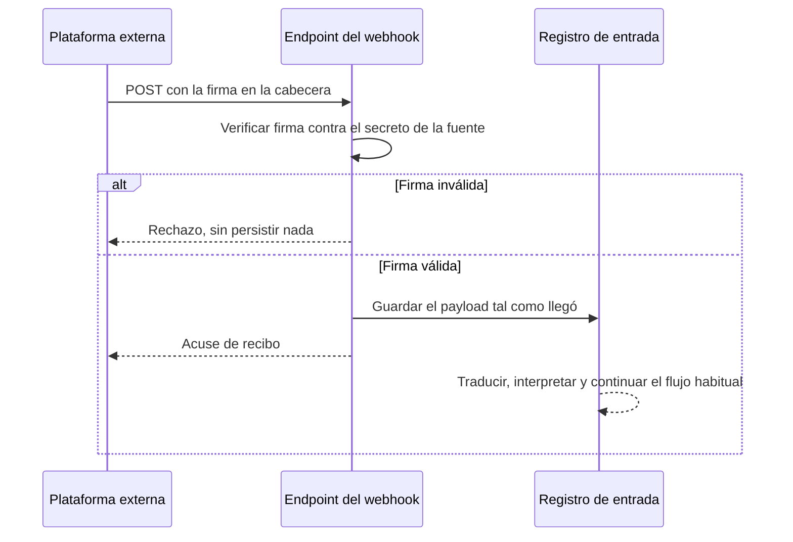

# Webhook entrante

Cómo debe entrar un lead desde una plataforma externa —un formulario de anuncios, un CRM de un
socio— sin que nadie tenga que teclearlo ni subir un fichero.

## Qué ya existe

El contrato no arranca desde cero. Tres piezas ya están construidas o reservadas:

- **La columna que guarda el secreto ya existe en la tabla de fuentes**, pensada para no requerir
  una migración propia cuando se construya el adaptador: guarda el hash del secreto, no el
  secreto en claro, siguiendo el mismo criterio que una contraseña.
- **El valor de catálogo para este tipo de fuente ya está declarado** en el modelo de dominio, así
  que declarar una fuente de este tipo no exige tocar ningún tipo.
- **El mecanismo de traducción de campos ya funciona**, y es el mismo que usa hoy la carga de
  fichero: cada fuente guarda cómo traducir lo que recibe a los campos que la plataforma entiende,
  así que un proveedor nuevo no necesita código propio salvo que exija un protocolo particular de
  verificación.

Lo que falta no es diseñar el contrato: es construir el adaptador que lo implementa.

## Qué falta construir

| Pieza | Estado |
|---|---|
| Endpoint público por fuente, sin credencial de usuario | No existe |
| Verificación de firma sobre el cuerpo de la petición | No existe |
| Generación y rotación del secreto compartido | No existe |
| Campo del secreto en el modelo de dominio de la fuente | No existe: la columna está reservada en la base de datos, pero la entidad todavía no lo expone |
| Pantalla de alta de fuentes externas, con su secreto | No existe |

El resto del recorrido no cambia: un payload que entra por este canal se persigue tal como llegó,
se traduce con el mapeo de la fuente, y sigue el mismo camino de viabilidad, puntuación y
asignación que un lead que entra por formulario o por fichero.

Un despachador de webhooks **salientes** con firma ya existe en el código y es una pieza distinta:
sirve para que esta plataforma avise a sistemas de terceros, no para que un tercero le envíe
leads. Está descrito en el [índice de la hoja de ruta](index.md).
