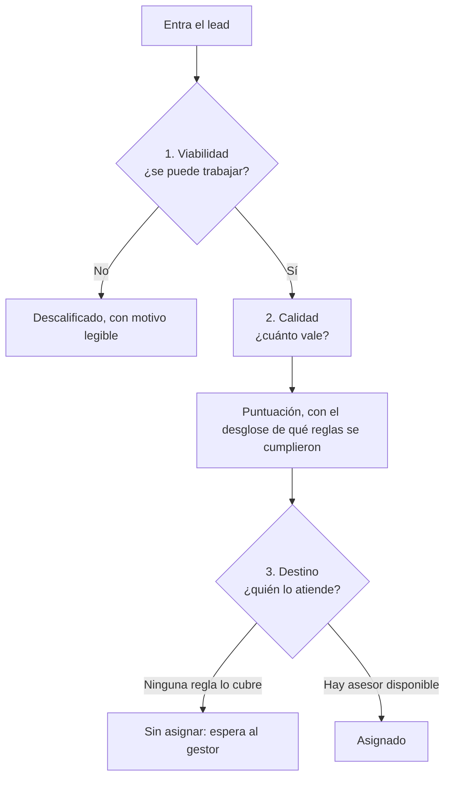
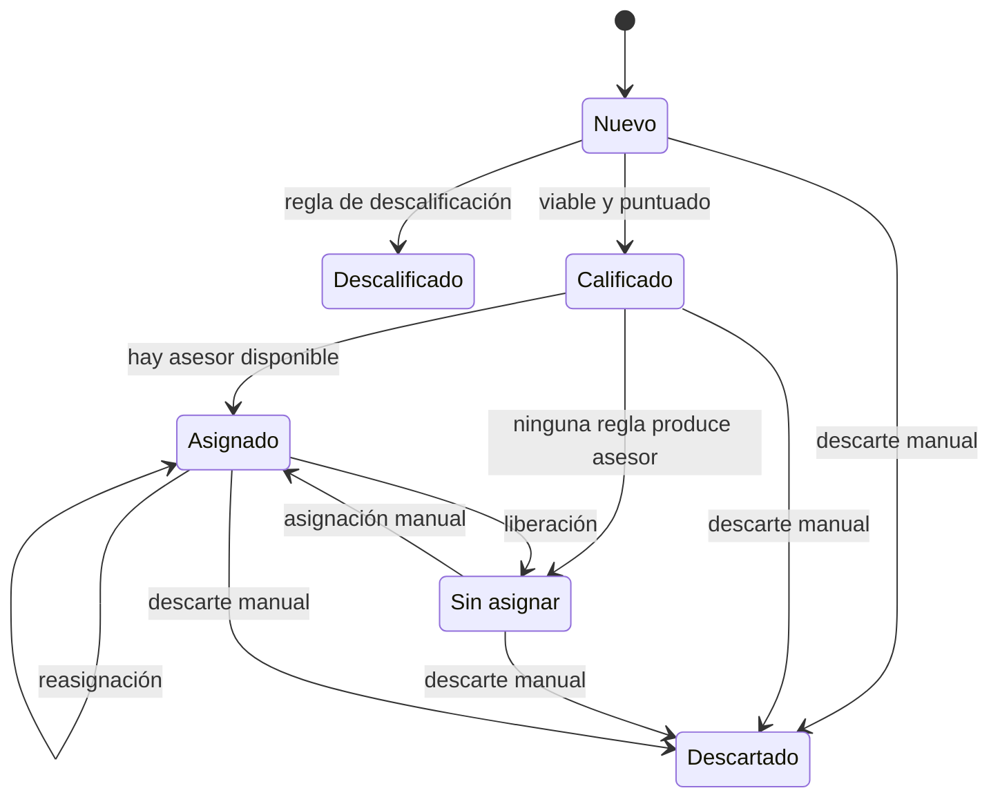

# El modelo de decisión

Con qué modelo decide la plataforma qué hacer con cada lead, y por qué está partido en tres etapas
en lugar de una sola puntuación.

## Tres decisiones de naturaleza distinta

Cada lead que entra dispara tres preguntas. Parecen variaciones de lo mismo —"¿qué hago con
esto?"— pero no son del mismo tipo, y ahí está la clave del diseño:

| Decisión | Pregunta | Naturaleza | Respuesta que admite |
|---|---|---|---|
| **Viabilidad** | ¿Se puede trabajar? | Binaria | Sí o no. No hay término medio |
| **Calidad** | ¿Cuánto vale? | Continua | Un valor en una escala, que ordena y admite tramos |
| **Destino** | ¿Quién lo atiende? | Categórica | Un equipo o una persona de un conjunto |

Un ejemplo de cada una:

- **Viabilidad:** el lead no dejó ni teléfono ni correo. No es que valga poco — es que no hay
  forma de contactarle. Ni el mejor asesor puede hacer nada con eso.
- **Calidad:** trae presupuesto declarado, empresa y un sector al que se vende. Vale más que otro
  que sólo dejó el nombre. Se puede ordenar.
- **Destino:** entró por la campaña de una red social, y esa campaña la atiende un equipo
  concreto. Nada que ver con lo bueno que sea el lead.

Son independientes. Un lead puede ser viable, excelente, y venir de esa campaña. Otro puede ser
viable, mediocre, y venir del formulario web.

## Qué pasa cuando se confunden

Si sólo hay una herramienta —la puntuación— para las tres decisiones, el gestor se ve obligado a
codificar en un número cosas que no son un número. Aparecen dos trucos, que son el mismo error en
espejo:

| Lo que el gestor quiere | El truco al que recurre |
|---|---|
| "Sin contacto, descartar siempre" | Restar una cantidad enorme de puntos para caer bajo el corte |
| "Los de una campaña, a un equipo" | Sumar una cantidad enorme y reservar un tramo alto |

Los dos se rompen igual: usan una escala continua para expresar algo que no es una cantidad. Una
regla que sume puede rescatar al primero por accidente, y dos campañas que necesiten tramos que no
se solapen desplazan al segundo fuera del suyo en cuanto se añade cualquier regla de calidad.

!!! warning
    En cuanto una regla suma o resta una cantidad de puntos fuera de toda proporción (±1000,
    ±9999), el modelo le está quedando corto a quien la escribió. Ese número no expresa calidad;
    expresa "por favor, haz que esto caiga donde yo quiero".

La corrección no es afinar los números: es darle a cada decisión la herramienta de su naturaleza.

| Decisión | Herramienta |
|---|---|
| Viabilidad (binaria) | **Reglas de descalificación**: condiciones sobre campos, con motivo |
| Calidad (continua) | **Reglas de puntuación**: suman y restan puntos |
| Destino (categórica) | **Reglas de asignación**: atributos y tramo de puntuación |

## El recorrido de un lead, en tres etapas

Tres etapas, tres responsabilidades. La primera corta el flujo: no tiene sentido puntuar ni
repartir algo que nadie puede trabajar. Las tres comparten la misma pieza para leer un lead —una
condición sobre un campo, comparada de una forma, contra un valor— documentada como
[ADR-0011](../decisiones/0011-gramatica-de-condiciones.md).

## Semántica de los estados

Un lead sólo puede estar en un estado, y cada uno responde a quién decidió y por qué. Es lo que
permite que la interfaz muestre bandejas con sentido en vez de una lista indiferenciada.

| Estado | Significa | Quién decidió | Qué hace el gestor |
|---|---|---|---|
| **Nuevo** | Acaba de entrar. Aún sin procesar | — | Nada. Es transitorio |
| **Descalificado** | No se puede trabajar | La máquina, por regla | Revisa la regla |
| **Calificado** | Vale la pena; pendiente de reparto | La máquina | Nada. Es transitorio |
| **Sin asignar** | Vale la pena, pero nadie lo cubre | La máquina se rindió | Lo asigna a mano |
| **Asignado** | Tiene asesor responsable | La máquina o el gestor | Puede reasignarlo o liberarlo |
| **Descartado** | Rechazado por una persona, con motivo | Un humano | Consulta el histórico |

Dos distinciones que parecen sutiles y son las que dan valor:

**Descalificado ≠ Descartado.** El primero es automático y su motivo lo da una regla ("sin datos
de contacto"). El segundo es una persona que miró el lead y escribió por qué no. Fundirlos
perdería la información de quién decidió, que es justo lo que el gestor necesita para saber si sus
reglas están bien escritas.

**Descalificado ≠ Sin asignar.** El primero no vale la pena; el segundo sí vale, pero no encontró
destino. Si se mezclaran, la bandeja de revisión manual se llenaría de leads sin contacto junto a
leads buenos, y el gestor dejaría de revisarla. Esa distinción es lo que mantiene la bandeja
utilizable.

### La bandeja de rechazados

Descalificados y descartados van a la misma vista, con una columna que distingue **máquina** de
**persona**. No es un archivo muerto: es donde el gestor comprueba si sus reglas están
descartando lo que deben. Una regla mal escrita se detecta ahí, no en los leads que sí pasaron.

## Cómo se componen las reglas

Una regla suelta rara vez expresa un criterio real. "Descartar al que no tenga forma de
contactarnos" no es una condición: son dos que deben cumplirse a la vez, sin teléfono **y** sin
correo. Si le falta sólo una, todavía se le puede escribir o llamar.

Escribir esas dos condiciones como dos reglas separadas produce el resultado contrario al
buscado:

| Lead | Teléfono | Correo | Con dos reglas sueltas | ¿Correcto? |
|---|---|---|---|---|
| Ana | — | ana@empresa.com | Descalificada | No: se le puede escribir |
| Beto | 600 123 456 | — | Descalificado | No: se le puede llamar |
| Carla | — | — | Descalificada | Sí |

Dos de cada tres mal, y no se arregla añadiendo más reglas: reglas separadas siempre significan
"basta con que se cumpla alguna".

Una regla admite varias condiciones, y se cumple cuando se cumplen todas. Con eso solo, el gestor
tiene las dos formas de combinar que necesita, sin aprender ningún concepto nuevo:

| Lo que quiere expresar | Cómo lo escribe |
|---|---|
| Se cumplen **todas** las condiciones | Una regla con varias condiciones |
| Basta con que se cumpla **alguna** | Varias reglas, una por condición |

Nunca aparecen las palabras "Y" ni "O" en la interfaz. El gestor lee "esta regla se cumple cuando
pasa todo esto", y si quiere alternativas, escribe otra regla. El razonamiento completo está en
[ADR-0012](../decisiones/0012-y-dentro-o-entre.md).

## Hacia dónde crece

*Visión de producto, fuera del alcance actual.*

Una regla con varias condiciones es deliberadamente la pieza mínima sobre la que se construye todo
lo demás. Un producto maduro en este espacio termina ofreciendo un constructor visual: un lienzo
donde el gestor arrastra nodos de condición, los encadena, y ve el recorrido que seguirá un lead
antes de guardarlo.

| Etapa | Qué añade |
|---|---|
| **Hoy** | Varias condiciones por regla. Se expresa cualquier criterio real, combinando reglas para las alternativas |
| **Producto** | Lienzo visual: nodos de condición encadenados, con vista previa del recorrido |
| **Producto maduro** | Biblioteca de reglas predefinidas por sector, y bloques reutilizables que el gestor compone y nombra |

Nada de esto cambia el modelo de datos: un lienzo visual es otra forma de escribir las mismas
condiciones. Por eso admitir varias condiciones por regla es lo que abre la puerta, aunque la
interfaz que las dibuje tarde en llegar.

## El lead que vuelve

*Fuera del alcance actual.*

Un mismo contacto puede entrar varias veces: rellenó el formulario, no le llamaron, volvió a pedir
información dos semanas después. Hoy la plataforma trata cada entrada como un lead nuevo e
independiente, porque nunca se le dijo qué significa "el mismo". Reconocerlo se llama
deduplicación o resolución de identidad, y está desarrollado en
[Identidad del contacto](../roadmap/identidad-del-contacto.md), con el valor que aportaría y las
decisiones que siguen abiertas.

## Qué es invariante y qué es regla

Las tres etapas anteriores comparten una pregunta de fondo: de las cosas que el sistema valida,
¿cuáles son ciertas siempre, y cuáles decide cada organización? El criterio que las separa, y el
catálogo completo de qué está en cada lado, viven en
[Qué decide cada organización](dominio-y-organizacion.md).

## Distancia entre este modelo y lo que hay hoy

| Elemento del modelo | Estado |
|---|---|
| Reglas de puntuación con condiciones sobre campos | Funciona |
| Desglose visible de qué reglas se cumplieron | Funciona |
| Reparto por tramo de puntuación, con estrategias | Funciona |
| Asignación y descarte manuales, con motivo | Funciona |
| Estado propio para "vale pero nadie lo cubre" | Funciona |
| Etapa de viabilidad con reglas del gestor | Funciona |
| Condiciones "está vacío" / "no está vacío" | Funciona |
| Combinar varias condiciones en una regla | Funciona |
| Reparto por canal, zona o especialidad | Funciona |
| Lead sin correo, conservado y revisable | Funciona. El correo es opcional, y lo que no se puede interpretar queda en la bandeja con su detalle en vez de perderse |
| Identidad del contacto entre entradas | No existe |

Lo único que sigue abierto es la identidad del contacto, y no por tamaño: el campo que decide si
dos entradas son la misma persona lo elige cada organización, así que arrastra su propia
configuración. Está desarrollado en
[Identidad del contacto](../roadmap/identidad-del-contacto.md).
